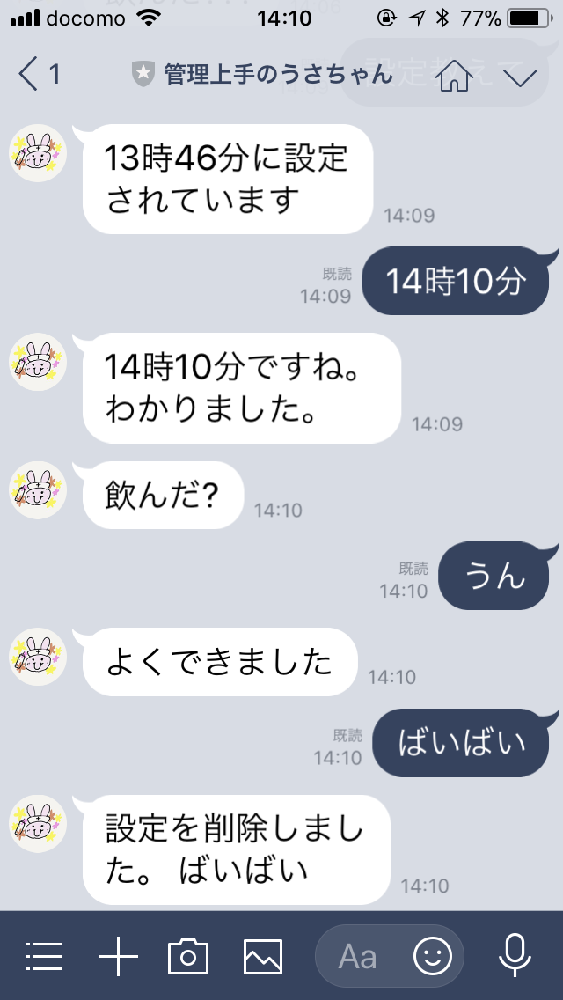

# 管理上手のうさちゃん

お薬を飲むのを忘れないためのリマインダーの`LINE bot`です。
毎日決まった時間に「飲んだ?」って聞いてくれます。
返信しなかったら、10分おきに10回まで聞いてくれるスヌーズ機能があります。

ちゃんとお薬飲もうね。



## 環境

- `heroku`でのホスティングを想定しています。
- `Heroku Redis`を設定の永続化のために利用しています。
- 言語は、`Go 1.10.1`です。
- シングルプロセスで稼働することを前提としており、冗長化はできません。
- Redisには、リマインド時間のみを永続化しています。再起動した場合には、スヌーズしている情報は消えてしまいます。
- 再起動しても、Redisに保存していた情報を読み込んでから再開するので、設定された時間は消えません。

## デプロイ

以下の環境変数を設定する必要があります。

- `CHANNEL_SECRET`
  - LINE APIのチャンネルの`secret key`
- `CHANNEL_TOKEN`
  - LINE APIのチャンネルの`access token`

heroku以外の環境にデプロイする場合は、以下の環境変数を設定してください。

- `PORT`
  - HTTPサーバーがListenするポート番号
- `REDIS_URL`
  - Redisの情報をURL形式で表す

heroku以外の環境にデプロイする場合は、`dep`を使って依存パッケージをインストールしてください。

```bash
dep ensure
```

## 送るメッセージ

### 時間の設定

```
xx時xx分
```

とメッセージを送ると時間を設定できます。

### 時間の確認

```
設定教えて
```

とメッセージを送ると、現在設定されている時間を設定できます。

### リマインドの停止

```
ばいばい
```

とメッセージを送ると、設定されている時間が削除され、お薬のリマインドが停止されます。


### 返信

```
飲んだ?
```

と聞かれたら、何かメッセージを返しましょう。返すと、その日のリマインドが終了します。

### LICENSE

MIT
